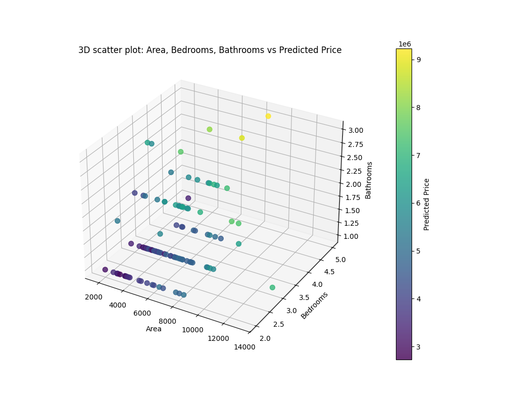

#🏠 Housing-Price-Prediction-Multiple-Linear-Regression.
A Machine Learning project that predicts housing prices using Multiple Linear Regression.
It uses the Kaggle Housing Dataset, trains a regression model with scikit-learn, and provides visualizations, evaluation metrics, and interactive predictions.

Features

✔️ Load and preprocess dataset (handle categorical features like mainroad)
✔️ Train a Multiple Linear Regression model with scikit-learn
✔️ Evaluate model using MSE and R² Score
✔️ 3D scatter plot visualization for area, bedrooms, and bathrooms vs predicted price
✔️ User interactive input to predict house price
✔️ (Optional) Store predictions in a SQLite database

📂 Project Structure
housing-price-prediction/
│── project.py                        
│── README.md                 
│── data/                 
│   └── Kaggle_housingdata.csv

📊 Visualization

The script generates a 3D scatter plot:

X-axis → Area
Y-axis → Bedrooms
Z-axis → Bathrooms
Color → Predicted Price

🛠️ Built With
Python
 🐍
Pandas  – Data processing
Scikit-learn – Machine learning model
Matplotlib– Data visualization

🧪 Output (with Example Answers)

This is a regression model — it returns a single numeric prediction (no classes).
Your “answer” is the predicted price.

INPUT AREA :
Enter area in feets (numeric): 3000
Enter number of bedrooms (numeric): 3
Enter number of bathrooms (numeric): 2
Enter number of parking spaces (numeric): 1
Is there a main road? (yes/no): yes

👉 The model predicts:

✅ Here the answer is the **predicted house price = 5,331,953.23**

